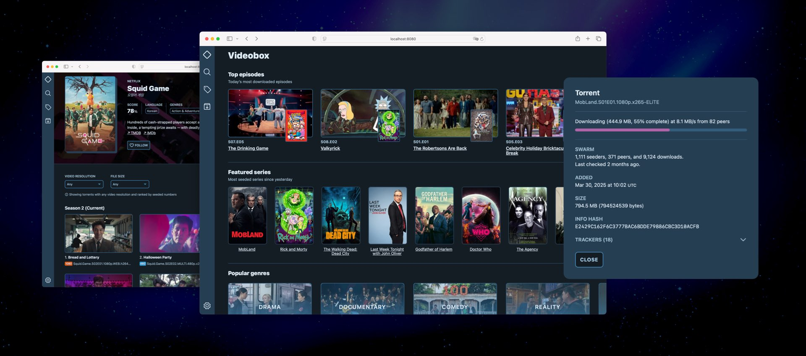

# Videobox

Videobox is a Python web app that lets you discover and download the latest TV series without annoying ads, tracking scripts, and crypto mining stuff.



**Note**: Videobox is a BitTorrent client so it can download series episodes without any other software. Additionally you can use your favourite BitTorrent client (like [uTorrent](https://www.utorrent.com), [Transmission](https://transmissionbt.com), etc.) with magnet links.

## Installation

Videobox requires the Python programming language version 3.9 or higher to be installed on your machine. If you are not familiar with it please refer to the official Python's [download page][d] for more information.

You can install Videobox along with the main Python installation of your machine or in so-called "virtual environment", which is the recommended approach, since its dependencies may clash with packages you have already installed. [Learn more about virtual environments][venv]. 

Install or update Videobox from [PyPI][2] via the Python `pip` utility. Again, type the following command in your terminal:

```
$ pip install -U videobox
```

## Quick start

You use Videobox via its web interface. To access it, start the `videobox` command on the terminal and point the web browser to the given URL:

```
$ videobox
Videobox has started. Point your browser to http://localhost:8080 to use the web interface.
Attempt to sync library... done, added 157 torrents.
Update swarm information... done, updated 1000 torrents.
Update completed, press CTRL+C to quit.
```

At startup Videobox updates its library and will attempt to do it again periodically.

Add `--help` to list all the available options:

```
$ videobox --help 
Usage: videobox [OPTIONS]

Options:
  --host TEXT     Hostname or IP address on which to listen. Default is
                  0.0.0.0, which means "all IP addresses on this host".
  --port INTEGER  TCP port on which to listen, default is 8080
  --help          Show this message and exit.
```

Don't miss the [wiki section][wiki] with contains developer documentation and in-depth information about using Videobox. If your are interested in hacking the source code or contribute to the project see the [contributing document][contrib]. 

## Roadmap

This is a rough plan of what I would like to implement in the upcoming releases:

* **0.9**: Automatic episodes download.
* **1.0**: Support for "complete season" torrents.

## Credits 

[Phosphor Icons][i] created by Helena Zhang and Tobias Fried.


[2]: https://pypi.org/project/videobox/
[i]: https://phosphoricons.com
[d]: https://www.python.org/downloads/
[venv]: https://docs.python.org/3/library/venv.html
[contrib]: CONTRIBUTING.md
[wiki]: https://github.com/passiomatic/videobox/wiki